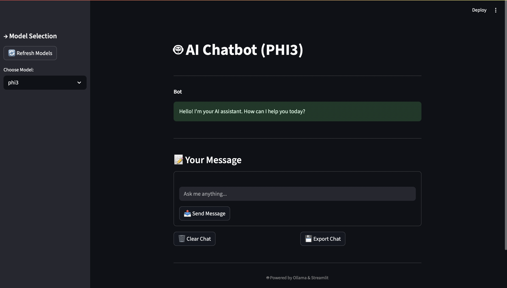

# LLM-Chatbot

## LLM Chatbot with Streamlit & Ollama

This is a locally hosted AI chatbot built using [Streamlit](https://streamlit.io/) and powered by Large Language Models (LLMs) via [Ollama](https://ollama.com/). The app allows you to chat with AI, switch between models, and export or clear your chat history — all in a lightweight and responsive web UI.

---

##  What Are LLMs?

**Large Language Models (LLMs)** are powerful AI systems trained on massive amounts of text. They understand and generate human-like responses and are the backbone of modern chatbots, assistants, and many other NLP applications.

---

##  Why Use LLMs in Chatbots?

- Understand natural human language and context
- Respond with flexibility (not rule-based)
- Ideal for educational tools, customer service, and automation
- Support multi-turn conversation and reasoning

---

##  What Are Tokens, and Why Do They Matter?

Tokens are the smallest units of text that an LLM processes. For example:
- `"ChatGPT is great!"` → might be split into 5 tokens: `"Chat"`, `"GPT"`, `" is"`, `" great"`, `"!"`

**Why they matter:**
- LLMs have token **limits per request**
- **Longer prompts = more tokens = more cost or slower response**
- Managing tokens keeps responses efficient and within bounds

---
## Preview

___

##  Features of This Chatbot

-  Runs entirely **locally** using Ollama
-  Maintains full **chat history** using `st.session_state`
-  **Switch between multiple models** (e.g., phi3, qwen)
-  Customizable **system prompt**
-  **Clear** chat or 💾 **Export** chat history to `.txt`
- Refresh available models dynamically
